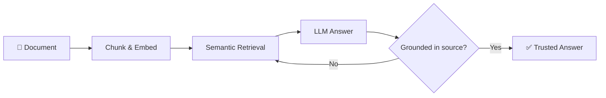

<p align="center">
  
</p>

<p align="center">
  
  
  
</p>

<p align="center">
  <a href="mailto:gowthumanikantasaranteja@gmail.com">
    
  </a>
  &nbsp;
  <a href="https://linkedin.com/in/teja-gowthu-4b8a65337">
    
  </a>
</p>

---

## 👋 About Me

<table>
<tr>
<td width="60%" valign="top">

- 🎓 **B.Tech in AI & Machine Learning**, Aditya University — CGPA 7.50
- 💻 Independent developer building scalable web apps and intelligent systems
- 🔭 Currently building **[DocuTrust](#-featured-project-docutrust)**, a self-correcting RAG platform for document analysis
- 🌱 Deepening my skills in cloud infrastructure, semantic search and FastAPI microservices
- 💡 Driven by clean architecture, strong problem-solving and shipping real projects
- 🌍 Cambridge English Empower **B2** certified

</td>
<td width="40%" valign="middle" align="center">

```python
class Teja:
    role   = "AI/ML Engineer"
    focus  = ["Backend", "RAG", "Search"]
    stack  = ["Python", "FastAPI", "LangGraph"]
    status = "Building DocuTrust 🚀"

    def open_to(self):
        return "Internships & Collabs"
```

</td>
</tr>
</table>

---

## 🛠️ Tech Stack

<p align="center">
  
</p>

<p align="center">
  
  
  
  
</p>

---

## 🚀 Featured Project: DocuTrust

A **self-correcting RAG platform** for document analysis: answers are checked against the source before they reach the user. High-level flow:



**Built with:** `Python` · `FastAPI` · `LangGraph` · `Semantic Search`

---

## 📊 GitHub Stats

<p align="center">
  
  
</p>

<p align="center">
  
</p>

<p align="center">
  
</p>

---

<p align="center"><i>💬 Thanks for stopping by — feel free to explore my repositories below, and let's build something together.</i></p>


